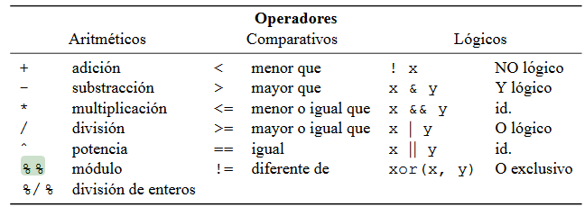
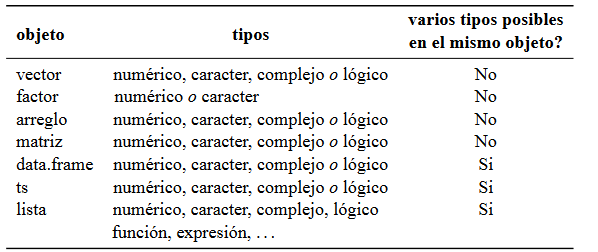

```{r setup, include=FALSE}
knitr::opts_chunk$set(echo = FALSE)
```

## ¿Por qué R?

- Software libre
- Multiplataforma: Linux, MacOS, Windows
- Comunidad grande de usuarios muy activos en internet
- Número grande de librerías


## Operadores básicos

| Operador | Significado                                                       |
| -------- | :--------:                                                        |
|**<-**    |	 Asignar (también **=**)                                         |
|**c**     |   Concatenar (función)                                            |
|**\#**    | 	 Comentar                                                        |
|**%>%**   |  *pipe line* (conector para secuencia de múltiples operaciones)   |

## Operadores



## Objetos




```{r cars, echo = TRUE}
summary(cars)
```

## Slide with Plot

```{r pressure}
plot(pressure)
```

