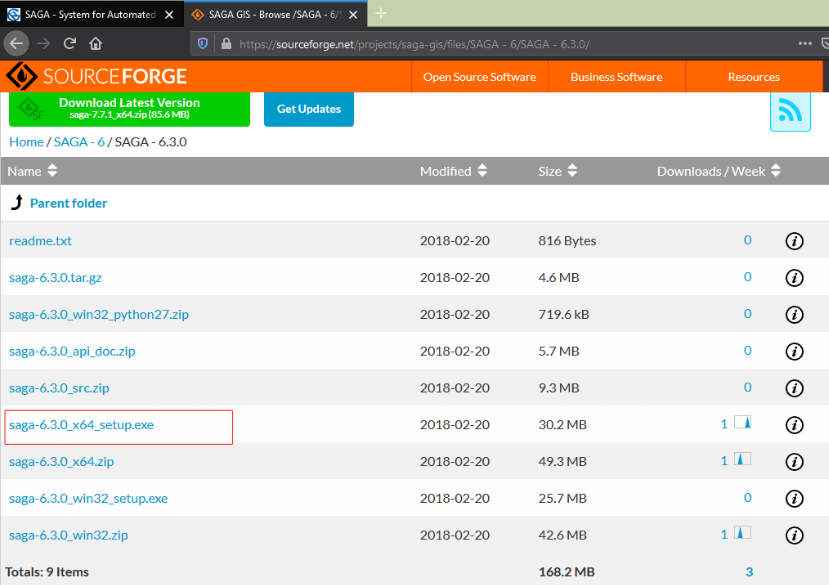

```{r setup, include=FALSE}
knitr::opts_chunk$set(echo = TRUE, message = FALSE, warning = FALSE)
```

En este documento usted econtrará los sitios web para descargar los programas R, Rtools, RStudio, SAGA, y algunos paquetes de R. La instalación le tomará un tiempo estimado entre 20 y 30 minutos. 

Los datos para el taller se encuentran en un repositorio de  [GitHub](https://github.com/lebalcazar/R_IITCA.git) (estará disponible minutos antes del taller). Es recomendable que usted tenga otro dispositivo a parte de su computador para ver la presentación y realizar los ejercicios en la máquina que tiene R. 

Además, descargar los siguientes datos de [Senegal](https://www.dropbox.com/s/tkkqyz2kaqoh4cj/DEM_Senegal.7z?dl=0) y   [México](http://www.conabio.gob.mx/informacion/metadata/gis/dipoest00gw.xml?_xsl=/db/metadata/xsl/fgdc_html.xsl&_indent=no), para este último elegir SHP1 coordenadas geográficas.


## Instalación de R y RStudio

Ingrese a la página de **CRAN** (*The Comprehensive $R$ Archive Network*) en [este link](https://cran.r-project.org/)  y descargue **R** para el sistema operativo de su PC (Linux/Window) o Mac. En una PC Windows seleccione Download R for Windows/base y descargue la versión reciente 4.x.x. Además, para máquinas con Windows es necesario descargar **Rtools** del [siguiente link](https://cran.r-project.org/bin/windows/Rtools/). 


Para descargar **RStudio** ingrese  en [este link](https://rstudio.com/products/rstudio/) y seleccione la pestaña _DOWNLOAD_ (en la parte superior derecha) y luego _RStudio Desktop_  en la versión gratuita. 

Instale los programas **R**, **Rtools** y **Rstudio** y siga las indicaciones de instalación.

## Primera sesión de R desde RStudio

Ejecute RStudio y se cargará automáticamente R. Al abrir RStudio por primera vez se mostrará como en la Figura \ref{fig1}. Por defecto el entorno de RStudio tiene 4 paneles, los cuales se pueden modificar en la pestaña _View/Panes_. Además, en la pestaña _Tools_ puede cambiar la configuración: color de fondo, tamaño y tipo de letra, etc. 


1) Es el *__Editor__* de código (presione las teclas `Ctrl+Shift+N`).

2) Se encuentra la __*Console*__ de R y el *__Terminal__*. 

3) Se encuentra el *__Environment__*, *__History__* y otros.

4) Se encuentran los (**_Files_**), los *__Packages__*, se despliegan los _**Plots**_, en la pestaña __Help__ se encuentra la ayuda de paquetes y funciones.


## Instalación de paquetes

Los paquetes o librerías (`packages()` o `library()`) en R son programas que permiten hacer un trabajo específico. El programa `base` de R tiene un amplio conjunto de librerías para hacer análisis de datos y estadístico, así como gráficos de alta calidad. Sin embargo, existen otros paquetes que son útiles para reducir las líneas de código y facilitan un ambiente más amigable para escribir el código.

En la consola de RStudio escriba `install.packages()`, como se muestra en las siguientes líneas para instalar las librerías tidyverse, tmap, lubridate y raster. 

```{r, eval=FALSE, echo=TRUE}
install.packages('tidyverse', 'tmap', 'lubridate', 'raster')
```

Para cargar las librerías en la sesión de R utilice la función `library()`. 

```{r}
# programas que se cargarán en la sesión de R
library(tidyverse)  # familia de paquetes para el análisis de datos
library(tmap)  # creación de mapas temáticos
library(lubridate)  # procesamiento de fecha y tiempo
```

Una vez cargada la(s) librería(s) en la sesión de R, abrir la ayuda de los paquetes para familiarse con ellos `?raster`, `?tmap`, `help("tmap")`, etc., o desde el panel `Help` puede navegar en la ayyuda. 

Instale los paquetes: `"RgoogleMaps", "ggmap", "mapproj", "sf", "osmar", "tidyverse","RColorBrewer","dplyr", "OpenStreetMap", "devtools",  "DT", "raster", "rgdal", "rworldxtra", 'grDevices', 'ggsn', 'tmap', 'utils', 'viridis', "datos", 'RColorBrewer', 'RSAGA', 'cptcity'`. Utilizar `install.packages()` como se mostró anteriormente.

Si alguna librería no se instala, ejecute las siguientes lineas:

```{r, eval=FALSE, echo=TRUE}
options(download.file.method = 'libcurl') # para conectar con la URL del paquete 
install.packages('nombre_del_paquete', dependences = TRUE)
```

Otra opción para instalar paquetes es descargando los archivos binarios desde la página de CRAN: <https://cran.r-project.org/> ver la Figura \ref{fig2}. Se descargan los archivos en un .zip. Luego en la pestaña Tools de RStudio ir a la pestaña Tools/Install Packages/Package Archive y buscar la carpeta que contiene el archivo .zip. 


En otras ocasiones (**NO SERÁ NECESARIO EN ESTE TALLER**) los programas no están en CRAN y se instalan desde un servicio git (github, gitlab o bitbucket) o Subversion, se utiliza el paquete *remotes* o *devtools* de la siguiente manera:

```{r, eval=FALSE, echo=TRUE}
install.packages("remotes")
# sin cargar las librerías remotes o devtools
remotes::install_github('autor/package_name')

# cargando la librería remotes o devtools
library(remotes)
install_gitlab('autor/package_name')

#Una vez instalado, se puede cargar la librería normalmente
library(package_name)
```

## Instalar SAGA GIS

Descargar e instalar SAGA desde el seguiente [link](https://sourceforge.net/projects/saga-gis/files/). Elija la versión 6.3 que ha sido testeada con la versión de RSAGA.




