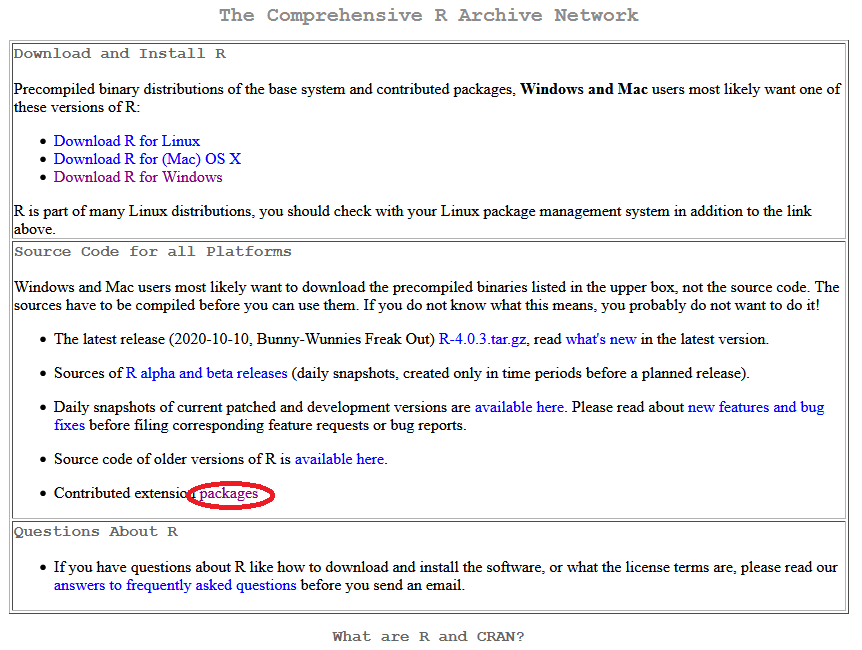

```{r setup, include=FALSE}
knitr::opts_chunk$set(echo = TRUE, message = FALSE, warning = FALSE)
```
## Instalación de R y Rstudio

Ingresar a la página de [CRAN](https://cran.r-project.org/) (*The Comprehensive $R$ Archive Network*) y descargar **R** para el sistema operativo de su PC (Linux/Window) o Mac. Seleccionar Download R for Windows/base y descargar la versión reciente 4.x.x. Además, para máquinas con Windows es necesario descargar [Rtools](https://cran.r-project.org/bin/windows/Rtools/) de la página de CRAN. 


Para descargar **Rstudio** ingrese al siguiente  [link](https://rstudio.com/products/rstudio/) y seleccione la pestaña DOWNLOAD RSTUDIO DESKTOP en la versión gratuita. 

Instale los programas descargados **R**, **Rtools** y **Rstudio** y seguir las indicaciones de instalación.

## Primera sesión de R desde Rstudio

Abrir el programa **Rstudio**, este cargará automáticamente **R**. Al abrir Rstudio por primera vez, se verá como se muestra en la Figura \ref{fig1}. Por defecto el entorno de **Rstudio** tiene 4 paneles, los cuales se pueden modificar en la pestaña View/Panes. Además, en la pestaña *Tools* puede cambiar la configuración, como el color, tamaño de letra, etc.


1) **El editor de código**, por defecto, se encuentra en la parte superior-izquierda. Aquí se escribe las líneas de código para un programa que se requiere guardar. 


2) En el panel izquierdo-inferior se encuentra **la consola** de **R**. Aquí se despliega el código que se ejecuta en el editor. Desde la consola también se puede escribir y ejecutar código, sin embargo, el código escrito en la consola se almacena temporalmente en la memoria, y se mantiene mientras dure la sesión y la computadora se encuentre encendida. Para limpiar la consola presione las teclas `Ctrl+L`. 

3) El **"environment"** de **R** se encuentra en la parte superior-derecha, aquí se almacenan los `objetos` creados en el editor y/o consola. Además, se puede revisar el historial (**History**) que se imprime en la **consola**.


4) En el panel derecho inferior se despliegan, por defecto, los archivos donde se encuentra el directorio de trabajo (**Files**). Además, en este panel se despliegan los gráficos (**Plots**), así como la ayuda (**Help**) y **Viewer**.


## Primer programa

Para crear un nuevo *Script de R* vaya a la pesataña File/New File/R Script o bien con la combinación de las teclas `Ctrl+Shift+N`.

Para documentar una línea utilice el signo `#`, todo lo que esté a la derecha de la mimsa linea no se ejecuturá. Para documentar un grupo de líneas presione `Crtl+C`, y para quitar la documentación es con el mismo atajo. Por ejemplo:

```{r, echo = T}
# Este es un comentario
# las lineas a continuación generan una matriz de 3 filas y tres columnas
# vector <- 1:9
# nrow <- 3
matriz <- matrix(1:9, nrow = 3)
```

Esto genera un objeto llamado *matriz*. Observe que las líneas que contienen los objetos *vector* y *nrow* están comentadas, por lo tanto no se ejecutan y no podremos encontrar dichos objetos. Podemos mostrar el contenido del objeto *matriz* en la consola simplemente ejecutando su nombre así:

```{r}
matriz
```

Vuelva al código donde se creó la matriz y observe que para asignar el resultado de un proceso a una variable se utiliza los signos `<-` (menor que y guión, sin espacios entre signos). Veamos otro ejemplo, para asignar a un objeto `a` un vector de 4 números aleatorios, se escribe de la siguiente manera:

```{r}
a <- rnorm(4)
```

También se puede asignar de esta manera `b = c(2,4)` o bien `c(2,4) -> b`, pero son inusuales. De hecho, la literatura especializada de **R** sugiere utilizar `<-` para la asignación de objetos.

Para imprimir en la **consola** lo que contiene el objeto `a`, se escribe el nombre del `objeto` y se presiona el botón **Run** o bien las teclas `Ctrl+Enter`. También se ejecuta con el comando `print(a)`.

```{r}
# escribiendo el nombre del objeto
a
# utilizando la función print()
print(a)
```

En el teclado, la asignación `<-` se realiza con `Alt+-` (Alt + guión).

Si desea ver todos los atajos del teclado presione `Shift+Alt+K`.

## Instalación de paquetes
Los paquetes o librerías (`packages()` o `library()`) en **R** son programas que permiten hacer un trabajo específico. El programa `base` de **R** tiene un amplio conjunto de librerías para hacer análisis de datos y estadístico, así como gráficos de alta calidad. Sin embargo, existen otros paquetes que reducen el tiempo de análisis y el número de líneas de código.

Para instalar las librerías es necesario ejecutar en la consola las siguientes lineas de código:

```{r, eval=FALSE, echo=TRUE}
install.packages('tidyverse', 'tmap', 'lubridate', 'tmap')
```

Para cargar las librerías en la sesión de R es necesario ejecutar las siguientes líneas:

```{r}
# programas que se cargarán en la sesión de R
library(tidyverse)  # familia de paquetes para el análisis de datos
library(tmap)  # creación de mapas temáticos
library(lubridate)  # procesamiento de fecha y tiempo
```

Todos los paquetes necesarios en el taller son: `"RgoogleMaps", "ggmap", "mapproj", "sf", "osmar", "tidyverse","RColorBrewer","dplyr", "OpenStreetMap", "devtools",  "DT", "raster", "rgdal", "rworldxtra", 'grDevices', 'ggsn', 'tmap', 'utils', 'viridis', 'RColorBrewer', 'RSAGA', 'cptcity'`. Utilizar `install.packages()` como se mostró anteriormente.

Si alguna librería no se instala, ejecute las siguientes lineas

```{r, eval=FALSE, echo=TRUE}
options(download.file.method = 'libcurl')
install.packages('nombre_del_paquete')
```

Otra opción es descargar los archivos binarios desde la página de CRAN: <https://cran.r-project.org/> ver la Figura \ref{fig2}. Se descargan los archivos en un `*.zip`. Luego en la pestaña `Tools` de Rstudio ir a la pestaña `Tools/Install Packages/Package Archive` y buscar la carpeta que contiene el archivo `*.zip` descargado. 




En otras ocasiones los programas no están en CRAN y se instalan desde un servicio git (github, gitlab o bitbucket) o Subversion, se utiliza el paquete *remotes* o *devtools* de la siguiente manera:

```{r, eval=FALSE, echo=TRUE}
install.packages("remotes")
# sin cargar las librerías remotes o devtools
remotes::install_github('autor/package_name')

# cargando la librería remotes o devtools
library(remotes)
install_gitlab('autor/package_name')

#Una vez instalado, se puede cargar la librería normalmente
library(package_name)
```
